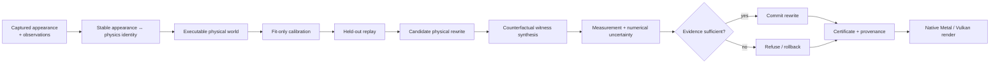

# Vulkax

<p align="center">
  <strong>Verified Rewritable Reality</strong><br/>
  Captured scenes → executable physical worlds → counterfactual edits → evidence → commit or refuse.
</p>

<p align="center">
  <a href="https://github.com/swayam8624/Vulkax/actions/workflows/paper-evidence-smoke.yml"></a>
  <a href="https://github.com/swayam8624/Vulkax/actions/workflows/paper-evidence-full.yml"></a>
  
  
  
  
</p>

---

## Why Vulkax exists

A captured 3D scene can look convincing while being **physically wrong**.

A reconstructed object may reproduce the trajectory that was observed, yet fail as
soon as we ask a counterfactual question:

- What if the material becomes stiffer?
- What if the fixture moves?
- What if the load direction changes?
- What if two interventions are applied together?
- What if we edit one local region and leave the rest unchanged?

That is the research problem behind Vulkax:

> **How do we turn a captured scene into a persistent, editable, physically
> executable world—and how do we know when an apparently successful physical repair
> is actually deceptive?**

Vulkax treats **verification, falsification, uncertainty, provenance and refusal**
as first-class parts of the world model.

It is not merely a renderer with physics attached.

---

## Research thesis

The project starts from a failure mode that ordinary fitting metrics cannot rule out:

[
L_{	ext{observation}}(M_{	ext{repair}})
<
L_{	ext{observation}}(M_{	ext{baseline}})
]

does **not** imply

[
M_{	ext{repair}}
	ext{ is physically more correct.}
]

A model can become observationally better while becoming mechanistically worse.

Vulkax calls this a **deceptive physical repair**.

The current research line investigates whether we can expose such repairs by
constructing counterfactual experiments that deliberately cancel model-common
response and reveal weaker mechanism-specific interaction structure.

---

# Dark-Field Counterfactual Spectroscopy

The central research instrument in the current branch is **Dark-Field
Counterfactual Spectroscopy (DCS)**.

The analogy is dark-field imaging: suppress the dominant signal so weak structure
becomes visible.

For a physical world (M), let

[
F_M(u)
]

be an observable response under intervention vector (u).

Instead of looking only at raw motion, construct a signed intervention stencil

[
mathcal D_{mu}[F]
=
sum_i w_i F(u_i)
]

with moment-annihilation constraints such as

[
sum_i w_i = 0,
qquad
sum_i w_i u_i = 0.
]

Constant and first-order/common response are cancelled, leaving higher-order
interaction structure.

A simple symmetric second-order witness is

[
F(+a)+F(-a)-2F(0).
]

A mixed two-intervention witness is

[
F(A,B)-F(A,0)-F(0,B)+F(0,0),
]

which isolates finite-amplitude response that cannot be explained by either
intervention independently.

For finite intervention sets, Vulkax also uses the Möbius-style interaction contrast

[
kappa(S)
=
sum_{Tsubseteq S}
(-1)^{|S|-|T|}F(T).
]

The mathematical primitives themselves are not claimed as new. The research
question is whether they can be turned into a **mechanism-selective falsification
system for captured executable worlds**.

---

## The deeper object: mechanism order of contact

Two candidate worlds may agree in ordinary state space and still disagree in how
they respond to perturbation.

Vulkax treats model equivalence as graded:

[
j^k F_{M_1}(0)
approx
j^k F_{M_2}(0)
]

means the worlds agree through mechanism order (k), within the available
measurement and numerical resolution.

The first order at which they separate is a candidate **mechanism order of contact**.

But higher order is useful only while the signal remains observable.

Define a maximum observable mechanism order through a signal-to-uncertainty rule:

[
k_{max}
=
max
left{
k :
rac{|mathcal D^{(k)}|}
{sigma_{	ext{measurement}}+
 sigma_{	ext{numerical}}+
 sigma_{	ext{repeat}}}
>
	au

ight}.
]

If two models differ only beyond the apparatus' mechanism resolution, Vulkax should
**refuse to pretend it knows**.

---

## Active experiment selection

The active-selection problem is not simply:

> find an input that makes two models disagree.

Instead, Vulkax searches for a **physically realizable contrast whose null space
contains the behavior the surviving models already share**.

For candidate worlds (M_1,ldots,M_K),

[
Gamma_{mu}(M_i,M_j)
=
rac{
|mathcal D_{mu}[M_i]-mathcal D_{mu}[M_j]|
}{
sqrt{
sigma^2_{	ext{measurement},mu}
+
sigma^2_{	ext{numerical},mu}
}
}.
]

One natural experiment-design target is

[
mu^*
=
argmax_mu
min_{i
e j}
Gamma_mu(M_i,M_j)
]

subject to moment annihilation, experiment cost and physical safety constraints.

---

# System architecture



The renderer and physical solver are intentionally not treated as one monolithic
state. Appearance, semantics, physical discretization, correspondence and evidence
remain explicit.

---

# Research directives

These are the rules that govern Vulkax research. They are stronger than ordinary
engineering conventions because the project is explicitly trying to avoid producing
convincing but false physical conclusions.

### 1. Falsify before promoting

Every promising mechanism must survive explicit attempts to kill it.

Positive controls show that an implementation can work. They do **not** establish
scientific validity.

### 2. Proposal and verification are separate

The mechanism that proposes a repair may not certify its own success.

### 3. Fit and evaluation data remain disjoint

No threshold may be tuned on the partition later described as frozen validation.

### 4. Negative results remain visible

Failed D2/D3/D4V gates are part of the research record and may not be rewritten into
a success story.

### 5. Numerical artifacts are physical-claim blockers

A witness that changes sign, explodes or fails refinement checks cannot be promoted
as mechanistic evidence.

### 6. Measurement provenance is explicit

Measured, derived, fitted, literature-proxy and unavailable quantities are kept
separate.

### 7. Refusal is a valid system result

When evidence is insufficient, the correct outcome is often:

```text
unresolved → refuse edit
```

rather than a low-confidence physical claim.

### 8. Research claims must survive matched baselines

DCS is compared against raw response, same-cost raw bundles, Fisher/Jacobian probes,
maximum-motion probes and random controls.

### 9. Retrospective evidence stays retrospective

The GAUGE mechanism contradiction is scientifically useful but is not re-labelled
as prospective confirmation.

### 10. Reproducibility is part of the result

A paper-facing number is not accepted into the canonical ledger unless its source,
configuration and reproduction path are preserved.

---

# Current research dashboard

| Stage | Evidence class | Current result | Scientific meaning |
|---|---|---|---|
| **D0** | implementation | ✅ pass | core annihilation/math contracts work |
| **D1** | constructed positive control | ✅ 64-case pass | implementation can expose designed deceptive repairs |
| **D2 frozen** | prospective synthetic validation | ❌ 0/16 resolved | fixed DCS did not achieve useful mechanism resolution |
| **D3** | synthetic discovery | ❌ 0/6 resolved | lower numerical floor did not create observability |
| **D4V** | repair-veto discovery | ❌ 0% resolved coverage | 14/36 repairs were deceptive, but no tested verifier resolved them |
| **GAUGE** | measured retrospective | ⚠️ mixed | aggregate metrics and longitudinal mechanism evidence disagree |
| **D5** | fresh measured confirmation | ⏸ not executed | intentionally blocked because prior gates did not justify it |
| **D6** | systems capability | ✅ implemented | spatial witness localization/export exists |

### Key frozen numbers

```text
D1 constructed positive control      64 cases
D2 frozen truth worlds               16
D2 resolved worlds                    0
D2 median standardized separation     0.041578   (reference = 2)

D3 truth worlds                       6
D3 resolved worlds                    0
D3 median k=2 numerical RMS            8.435e-7 m
D3 median k=3 numerical RMS            2.153e-7 m

D4V repair proposals                  36
D4V deceptive                         14
D4V beneficial                        22
D4V resolved coverage                  0%

GAUGE ordinary overlap wins           10 / 10
GAUGE marker dark-field endpoint wins  0 / 10
GAUGE longitudinal endpoint wins       9 / 10
```

---

## Information frontier

The D4V result is not merely a near miss.

At the inherited (|z|ge2) credibility reference:

| Method | Median (|z|) | Maximum (|z|) | Median signal amplification needed to reach 2 |
|---|---:|---:|---:|
| DCS | 0.05024 | 0.17654 | **39.83×** |
| raw bundle | 0.04991 | 0.40615 | 40.10× |
| raw point | 0.14707 | 0.63142 | **13.60×** |
| Fisher | 0.06637 | 0.63142 | 30.15× |
| max motion | 0.05773 | 0.57505 | 34.64× |

This is a post-hoc diagnostic, not a new gate.

It strengthens the current engineering conclusion:

> **The tested regime is information-limited. The next breakthrough needs a more
> informative physical channel, not a slightly looser threshold.**

See
[`research/results/DCS_INFORMATION_FRONTIER_2026-09-20.md`](research/results/DCS_INFORMATION_FRONTIER_2026-09-20.md).

---

# GAUGE: the motivating measured contradiction

The public GAUGE foam-shearing benchmark produced the clearest mechanism-level
contradiction in the current research line.

A finite fixture-overlap repair improved ordinary held-out metrics in every tested
repeat:

```text
ordinary face + marker preference:
overlap 10 / 10
```

Marker dark-field response agreed with the aggregate metric:

```text
marker dark-field:
overlap 10 / 10
```

But the longitudinal mechanism channel reversed:

```text
longitudinal dark-field:
endpoint 9 / 10
```

Exploratory retrospective exact sign-test:

[
p=0.02148.
]

This result is intentionally labelled **retrospective** because the metric mirage was
known before DCS was designed.

---

# What Vulkax currently contributes

### Systems contributions

- persistent stable identity across appearance and physical representations;
- versioned captured-world evidence bundles;
- nonlinear APIC/MPM execution;
- fit-only inverse calibration;
- held-out replay and robustness evidence;
- operator/material influence estimation;
- adaptive local rewrite proposals;
- evidence-derived atomic commit / rollback semantics;
- native Metal and Vulkan Gaussian rendering;
- schema-versioned certificates and evidence registries;
- reproducible measured-data pipelines.

### Research infrastructure

- annihilating intervention contrasts;
- finite-amplitude counterfactual interaction decomposition;
- automatic stencil synthesis;
- pair-aware uncertainty handling;
- witness-space numerical uncertainty;
- adaptive-order experiments;
- deceptive-repair benchmarks;
- matched raw/Fisher/max-motion baselines;
- spatial dark-field localization;
- frozen confirmatory replay infrastructure;
- deterministic paper-data/figure generation.

### Research finding

The strongest current finding is not that DCS is already a deployable verifier.

It is that **ordinary observational improvement can be physically deceptive**, while
the currently tested counterfactual verification channels can remain too
information-poor to issue a credible support/veto decision.

That is a more useful result than hiding the failure behind a relaxed threshold.

---

# Potential impact

If the central research program succeeds, the same abstraction could matter wherever
a captured or reconstructed scene is later used as an executable world rather than
a static visualization:

- physically editable digital twins;
- inverse graphics + inverse mechanics;
- robotics simulation from real captures;
- XR environments whose objects are meant to behave, not merely render;
- material and boundary-condition model criticism;
- simulation credibility / verification workflows;
- captured-world authoring tools that can **refuse unsupported edits**.

The long-term goal is a world model that can answer not only

> “does this reconstruction look right?”

but

> **“what physical claims are actually justified by the evidence we have?”**

---

# One-command full research reproduction

The canonical research branch is:

```text
research/integration-20260920
```

From a fresh clone:

```bash
git clone --branch research/integration-20260920 --single-branch \
  https://github.com/swayam8624/Vulkax.git
cd Vulkax

./run_everything.sh --clean
```

The runner automatically selects Metal on macOS and Vulkan on Linux when available.

Useful variants:

```bash
./run_everything.sh --backend Metal
./run_everything.sh --backend Vulkan
./run_everything.sh --backend none
./run_everything.sh --skip-gauge
./run_everything.sh --skip-performance
./run_everything.sh --exhaustive
```

The full run performs:

1. environment and hardware provenance capture;
2. reusable Python-tool validation/self-tests;
3. complete Release build;
4. full CTest suite;
5. evidence/release/CLI validation;
6. native backend conformance;
7. deterministic captured-world execution;
8. timing evidence;
9. D1;
10. solver-native discovery;
11. automatic active selection;
12. D2;
13. D3;
14. D4V;
15. GAUGE measured-data fetch and effective-span validation;
16. 20 definitive GAUGE forward simulations;
17. information-frontier diagnostics;
18. frozen-result reproduction validation;
19. deterministic paper figures/tables;
20. SHA-256-indexed evidence packaging;
21. portable archive creation.

Detailed guide:
[`docs/PAPER_EVIDENCE_REPRODUCTION.md`](docs/PAPER_EVIDENCE_REPRODUCTION.md).

---

# Paper-data package

The repository contains the complete non-manuscript source package for the research
that has actually been executed.

Start here:

- [research paper-data map](research/paper_data/README.md)
- [final benchmark summary](research/results/DCS_FINAL_BENCHMARK_SUMMARY_2026-09-20.md)
- [machine-readable final ledger](research/results/DCS_FINAL_RESULTS_2026-09-20.json)
- [experiment matrix](research/paper_data/EXPERIMENT_MATRIX.csv)
- [ablation matrix](research/paper_data/ABLATION_MATRIX.md)
- [figure/table source map](research/paper_data/FIGURE_TABLE_SOURCE_MAP.md)
- [reproducibility checklist](research/paper_data/REPRODUCIBILITY_CHECKLIST.md)
- [claim guard](research/literature/CLAIM_GUARD.md)
- [limitations / kill criteria](research/status/DCS_LIMITATIONS_AND_KILL_CRITERIA.md)

A successful full run creates:

```text
build/paper-evidence/
├── README.md
├── manifest.json
├── artifact_index.csv
├── SHA256SUMS
├── canonical/
├── generated/
├── logs/
└── system/
```

plus:

```text
build/vulkax-paper-evidence-<commit>.tar.gz
build/vulkax-paper-evidence-<commit>.tar.gz.sha256
```

---

# Generated result widgets

The paper-data generator produces deterministic SVG figures with a source CSV for
each figure:

<details>
<summary><strong>Open generated-asset list</strong></summary>

```text
fig_ranking_agreement.svg
fig_standardized_separation.svg
fig_numerical_floor.svg
fig_d4v_proposals.svg
fig_gauge_channel_contradiction.svg
fig_information_frontier.svg

table_stage_outcomes.csv
table_claim_boundaries.csv
table_information_frontier.csv
figure_manifest.json
```

Generated under:

```text
build/paper-figures/
```

</details>

---

# Repository / branch hygiene

No, all repository branches are **not** needed.

Current audit:

| Branch class | Count |
|---|---:|
| Canonical / intentionally retained | **4** |
| Fully contained and safe to delete | **25** |
| Divergent with unique commits requiring audit/archive | **28** |
| **Total** | **57** |

Open pull requests: **0**.

The intended long-term topology is:

```text
main
release/1.0.0
legacy/studio-v1-2026-08-10
research/integration-20260920
```

with temporary feature/research branches only while work is active.

Current branch audit:
[`research/status/BRANCH_AUDIT_2026-09-21.md`](research/status/BRANCH_AUDIT_2026-09-21.md).

Dry-run cleanup:

```bash
bash research/scripts/audit_branch_cleanup.sh
```

Delete only branches that are **still proven fully contained at execution time**:

```bash
bash research/scripts/audit_branch_cleanup.sh --delete
```

The cleanup helper refuses protected branches and refuses any branch that still has
one or more unique commits relative to the canonical integration line.

---

## Current implementation — Vulkax 1.0

**Vulkax 1.0 is the stable verified-rewritable-reality baseline.**

The stable release freezes the implemented 0.39–0.90 engineering path without
retroactively adding research claims.

See [`docs/RELEASE_1_0.md`](docs/RELEASE_1_0.md).

### Baseline capabilities

- renderer-independent Gaussian appearance;
- ASCII/binary 3DGS PLY ingestion;
- persistent composite `GaussianId`;
- reorder-safe selection/correspondence/rollback;
- versioned captured-deformable evidence bundles;
- affine MLS appearance↔physics coupling;
- nonlinear APIC/MPM replay;
- fit-only material calibration;
- held-out replay;
- finite-difference and controlled adjoint influence paths;
- adaptive local rewrite proposals;
- atomic verified rewrite transactions;
- native Metal / Vulkan Gaussian paths;
- schema-versioned certificates;
- measured DOT C2 benchmark support;
- deterministic presentation/showcase assets.

The project remains **C++20**.

---

## One-command captured-world research + showcase — 0.80

The release-facing captured-world workflow remains available independently of the
new paper-evidence runner:

```bash
./build/vulkax captured-world-run \
  build/captured-example/capture.vkcap \
  build/captured-world-run \
  m4 0.003 1 1 1 \
  Metal 0.08 0.01 0.02 12345 \
  --showcase studio_pedestal \
  --showcase-assets build/demo-assets \
  --showcase-resolution 1280x720 \
  --turntable 12
```

Use `Vulkan` on a Vulkan-capable Linux build or `none` when no native render
dependency is desired.

A completed run is not synonymous with a verified rewrite. The certificate records
run completion separately from the rewrite decision.

See
[`docs/CAPTURED_WORLD_RUN_0_80.md`](docs/CAPTURED_WORLD_RUN_0_80.md).

---

# Measured deformable benchmark — 0.45

The stable release also includes the public CC0 DOT C2 measured deformable benchmark.

Current controlled result:

```text
stable measured correspondences       225
observations                           675
fit / held-out rows                    585 / 90
model-conditioned effective E          7500 Pa
model-conditioned nu                   0.45
fit dynamic RMS                        0.004390821778 m
held-out dynamic RMS                   0.004417317099 m
adaptive regions                       8
adaptive particles                     182 / 225
retained absolute-gradient mass        0.9480125633
selected measured rewrite              rejected
rollback                               performed
```

The rejected rewrite is intentionally preserved as evidence.

See
[`docs/MEASURED_BENCHMARK_0_45.md`](docs/MEASURED_BENCHMARK_0_45.md).

---

# Build and test

### macOS / Linux

```bash
cmake -S . -B build \
  -DCMAKE_BUILD_TYPE=Release \
  -DVULKAX_BUILD_TESTS=ON

cmake --build build --parallel
ctest --test-dir build --output-on-failure
```

### Windows

```powershell
cmake -S . -B build -DVULKAX_BUILD_TESTS=ON
cmake --build build --config Release --parallel
ctest --test-dir build -C Release --output-on-failure
```

Detailed platform setup:
[`docs/INSTALL_0_90.md`](docs/INSTALL_0_90.md).

Performance methodology:
[`docs/PERFORMANCE_0_90.md`](docs/PERFORMANCE_0_90.md).

---

# Release validation

```bash
python3 scripts/validate_evidence_registry.py .
python3 scripts/audit_release_claims.py . --expected-project-version 1.0.0
python3 scripts/test_release_cli_failures.py --executable build/vulkax
python3 scripts/benchmark_captured_world_run.py \
  --executable build/vulkax \
  --iterations 3 \
  --backend none
```

---

# Research integrity / current non-claims

The current repository **does support**:

- deterministic controlled captured-world execution;
- stable capture / Gaussian identity contracts;
- transactional rewrite rollback;
- native Metal/Vulkan image regression;
- real measured-data ingestion and held-out replay;
- DCS implementation and matched-baseline experiments;
- frozen negative D2/D3/D4V results;
- retrospective GAUGE mechanism contradiction;
- one-command evidence reproduction;
- SHA-256-indexed paper-data packaging.

The current repository **does not establish**:

- DCS as a universal physical correctness certificate;
- DCS superiority over matched raw/Fisher baselines;
- useful prospective repair-veto coverage in the tested D4V regime;
- fresh measured prospective D5 confirmation;
- true material-property recovery from GAUGE or DOT where the source data do not
  provide the required ground truth;
- publication acceptance;
- publication novelty by implementation alone.

---

# Research map

| Need | Start here |
|---|---|
| What is Vulkax trying to solve? | this README |
| Current research state | [research/README.md](research/README.md) |
| Final numbers | [research/results/README.md](research/results/README.md) |
| Paper data | [research/paper_data/README.md](research/paper_data/README.md) |
| Reproduction | [docs/PAPER_EVIDENCE_REPRODUCTION.md](docs/PAPER_EVIDENCE_REPRODUCTION.md) |
| DCS program | [research/status/DCS_RESEARCH_PROGRAM.md](research/status/DCS_RESEARCH_PROGRAM.md) |
| Limitations | [research/status/DCS_LIMITATIONS_AND_KILL_CRITERIA.md](research/status/DCS_LIMITATIONS_AND_KILL_CRITERIA.md) |
| Novelty threats | [research/literature/DCS_NOVELTY_THREAT_MAP.md](research/literature/DCS_NOVELTY_THREAT_MAP.md) |
| Claim boundaries | [research/literature/CLAIM_GUARD.md](research/literature/CLAIM_GUARD.md) |
| Branch cleanup | [research/status/BRANCH_AUDIT_2026-09-21.md](research/status/BRANCH_AUDIT_2026-09-21.md) |
| Release roadmap | [docs/ROADMAP_1_0.md](docs/ROADMAP_1_0.md) |

---

## Development rules

- Proposal and verification remain separate.
- Synthetic evidence stays labelled synthetic.
- Measured, derived and proxy quantities remain distinguishable.
- Frozen validation partitions are never threshold-tuning datasets.
- Numerical convergence is part of physical credibility.
- Failed experiments remain visible.
- A system may refuse to make a physical claim.
- Reproduction artifacts are evidence, not decoration.

